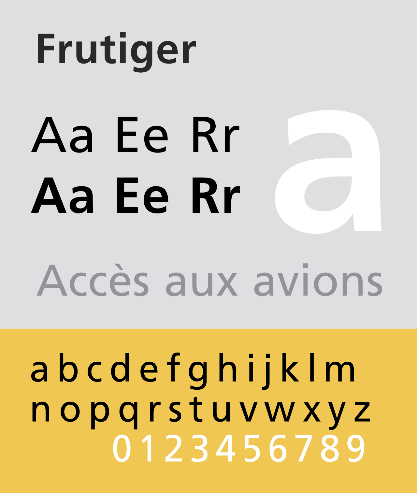
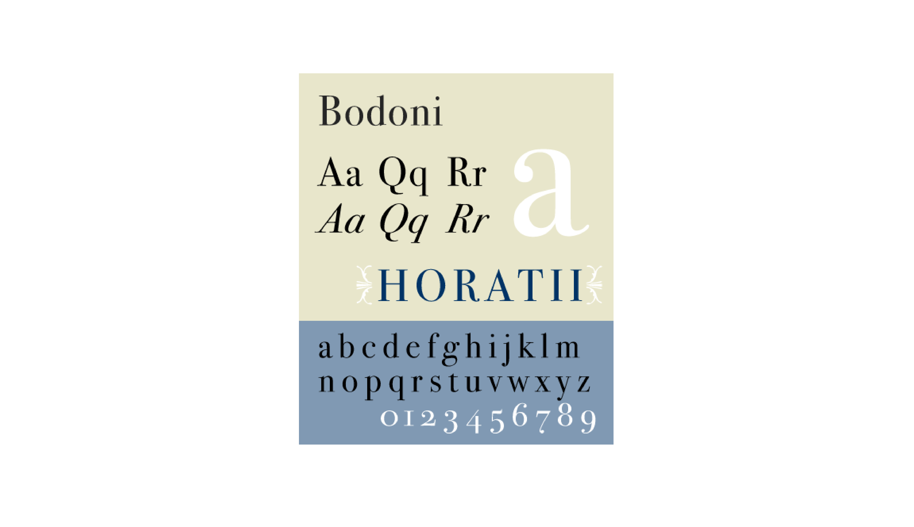

The world is a big place! Thousands and thousands of unique cultures, languages and outlooks make up planet Earth today, and with that massive scope comes a myriad of design philosophies and ideas.

Let's take a look at some of the more interesting typefaces that have managed to permeate universal design. These typefaces appear frequently across the globe and are therefore technically some of the most famous pieces of graphic design ever created... however, possibly also some of the most overlooked.  

At No. 10 is **Furtiger**, designed by Adrian Frutiger in 1977. 

This stylish, modern sans-serif font was initially commissioned for the signage of a new airport in Paris but has since become a staple of modern typographic design, finding use as the font of choice for the NHS and the WHO. 

In at No. 8 is **Futura**, designed by Paul Renner in 1927. 

Futura has become well known for its highly geometric design, finding extensive use in marketing and becoming the headline font for the Volkswagen car company and the Supreme fashion brand to name a few.

No. 6 is **Bodoni**, created by Giambattista Bodoni in 1790. 

