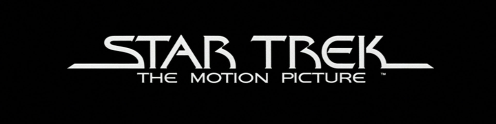

If you were to imagine a typeface from the distant future, what would it look like? Would we marvel at its brilliance or question its other-worldliness? Would typefaces even still be relevant forms of design? 

Graphic designers were faced with these questions when sci-fi culture began to take off in the early 70s; directors and authors needed a style that, at a glance could let the viewer know that whatever media the type was emblazoned upon fell into the science-fiction genre. 

'Sci-Fi' style typefaces are especially interesting since they often depict the design languages that the designers imagine becoming prevalent in the future, making them interesting snapshots into what direction artists and designers believes their industries were going at the time of the typefaces creation.

A good example of this design mindset comes in the form of the *Computerfont* typeface that was prevalent throughout the seventies not just in sci-fi media, but in anything that wanted to appear futuristic and up-to-date... most notably mathematics text books. 

*Computerfont* is defined by its sharp increases and decreases in contrast. This was likely done to make the font appear visually distinctive on the primitive screens of the time by having clear protrusions that could be displayed more easily on low resolution screens. This design choice may have also stemmed from the desire to create a visually appealing typeface that would be completely computer-centric which, at the time, would have been a reasonable decision due to the rapidly growing personal computer market. 

Another typeface that is still prominent today would be that created for the Star Wars movie's branding. Although this typeface was never officially named or released, several design studios have faithfully recreated it, a prominent example being *[Star Jedi](https://www.fontspace.com/star-jedi-font-f9641)* created by Boba Fonts. 

This typeface achieves a sleek, futuristic look that, arguably unlike *Computerfont*, still holds up in 2020. Thick, clear lettering combined with the occasional bold, modern serifs and a monospaced design excellently encapsulate the galaxy-at-war aesthetic that George Lucas was creating within the Star Wars universe. In the iconic Star Wars logo, the text is also transparent with a bright yellow highlight, giving the already futuristic typeface a sci-fi twist. 

Another success story of the 1970's, Star Trek tackles a more nuanced and complex story in the form of a character drama set in a distant future. Its typographical design reflects this with elements also seen in the Star Wars design however with a thinner, taller appearance and more extreme angles, denoting the deep, complex political world that the show is set within. 

The Star Trek typeface was adjusted for the official motion picture, taking on a sleeker, more curvaceous serifed look which combines the heritage of the show with an almost fantasy style alongside the brands already established sci-fi roots; a bold decision that I think works well in communicating the connection between past and future. 

Sci-Fi has a distinct style... which is unusual when you realize just how differently designers approach creating a futuristic aesthetic. One of the most interesting elements of sci-fi design is that it is very much open to interpretation; obviously, the future hasn't happened yet so whatever the designer perceives as being 'futuristic' can be run with to create a portrayal of reality that is believable in a sci-fi context, making the whole design culture one of the most open-ended and experimental in the industry.