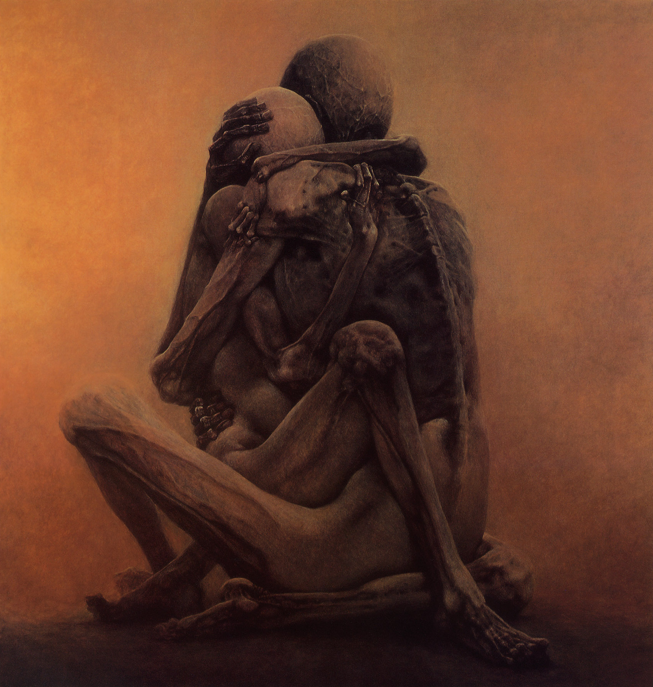
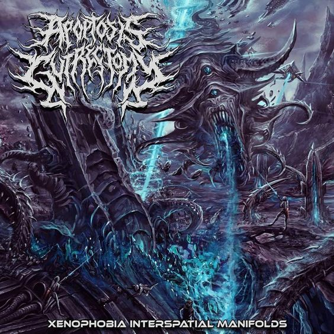
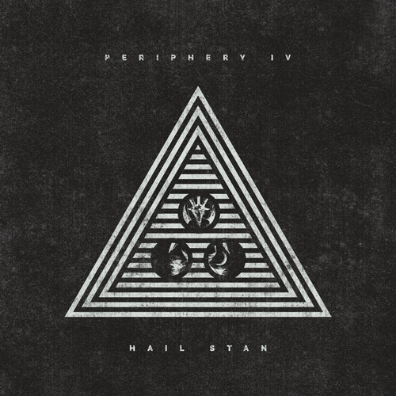
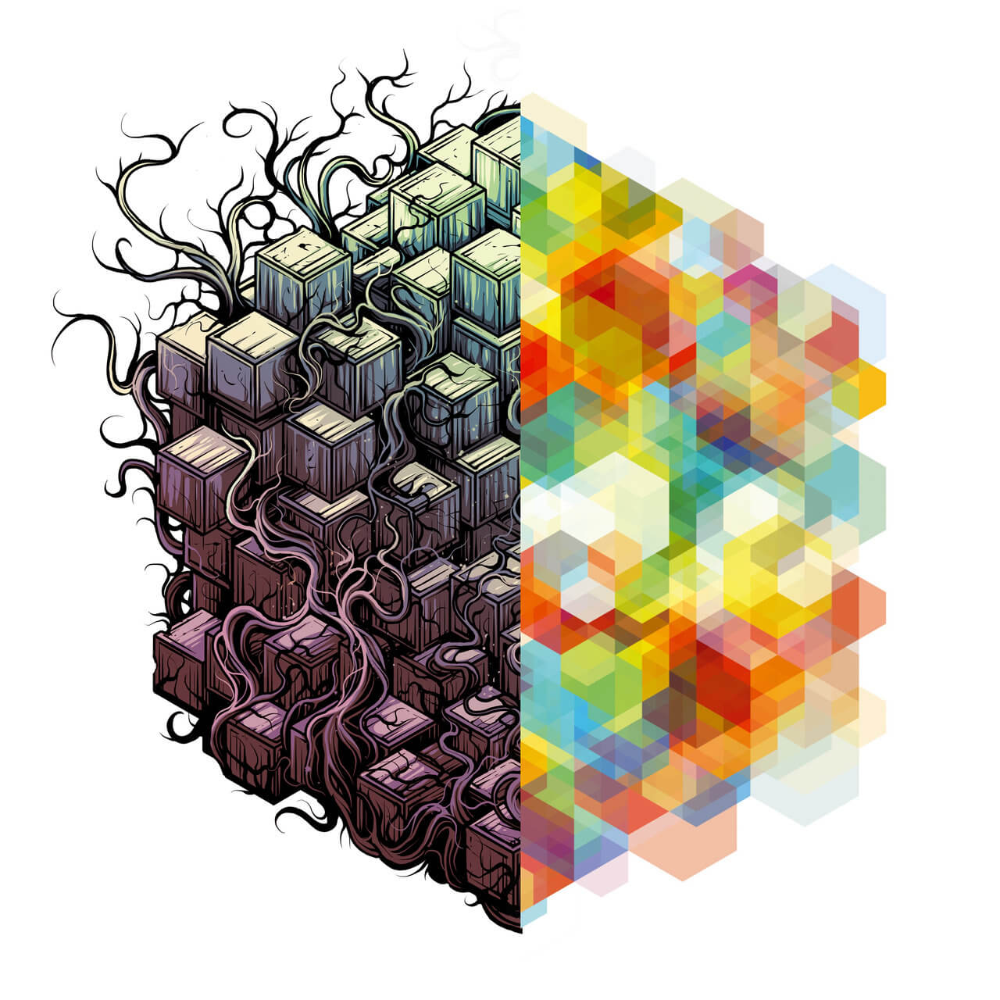

Metal music. We all know it. Some love it. Some can't stand it. But all can agree that, if nothing else, it is a genre of music that, over the last 50 years, has become globally recognisable both for its iconic sound and for the culture that surrounds and embodies it. 

In this multi-part series, we will look into how design and typefaces are used by different sectors of the musical world; and where better to start than with the often dark and ever intriguing metal scene.

[Rick Poynor](https://designobserver.com/feature/from-the-archive-graphic-metallica/34488) describes the visual style of heavy metal music as being 'aesthetic extremism' with designs often being as over-exaggerated and aggressive looking as possible to match the explosive nature of the music it is presenting. In the early days, metal bands did not have the branding power associated with the internet today so had to visually define their sound with their album covers in order to generate interest, resulting in some truly iconic designs. 

The traditional metal look comes from a combination of bold aggressiveness, often utilising thick, clear lettering culminating in sharp points as well as elements of Blackletter to lend a gothic element to the design. This idea is exemplified well in the logo of Swedish metal band *Ghost* (depicted above.) *Ghost* also incorporate an inverted cross into their design; religion and religious themes are common in metal music, making this design choice one of the most effective methods of tying a visual identity into the music. 

Connections have also been made between the fonts used by metal bands and the traditional Germanic fonts used by the Nazi party during their reign of power, predominantly due to the fact that the type now has connotations of evil and violence. This style is most apparent in the iconography of bands like *Kiss, Slayer* and *Black Sabbath.* 

Another well-known visual style found within the metal scene is the often dramatic and grotesque artistic style that accompanies the sub-genre known as death metal. Polish artist Zdzisław Beksiński (sometimes coined 'The Nightmare Artist') is often credited with inspiring the visual identity of death metal though his art, described by himself as 'dystopian surrealism.' 

This idea often carries over into the visual design of death metal albums, often using typefaces so aggressive and abstract that they become intentionally near-illegible, reflecting the extremity of the music even within an already outlying parent genre. 

While the most extreme elements of the metal design aesthetic still exist within its sub-genres, modern metal music has started to incorporate less extreme elements, particularly within the progressive metal sub-genre, known best for its experimental and modern interpretations of metal music. Bands like *Architects, Periphery* and *TesseracT* all incorporate some degree of minimalism in their album art whilst retaining some hallmarks of previous metal design. 

For example, *Periphery* use a futuristic, modern typeface for their logo and text while incorporating more traditional metal elements into their artwork, representing their roots in 'old-school' metal whilst outlining their innovative and modern experimental nature. 

Other bands take this idea a step further, *TesseracT* often does away with text completely in their album art, preferring to use a purely visual depiction between old and new styles of metal. 

To some, metal will always be just noise. However, the typography and design of the genre tells a different story, often portraying the more nuanced sides behind the often chaotic exterior. Whether distorted guitars and screaming vocalists appeal to you or not, nothing can take away from the inarguable impact that metal music has had on the industry and, by extension, the effect that its visual style has had on modern design philosophy as a whole.