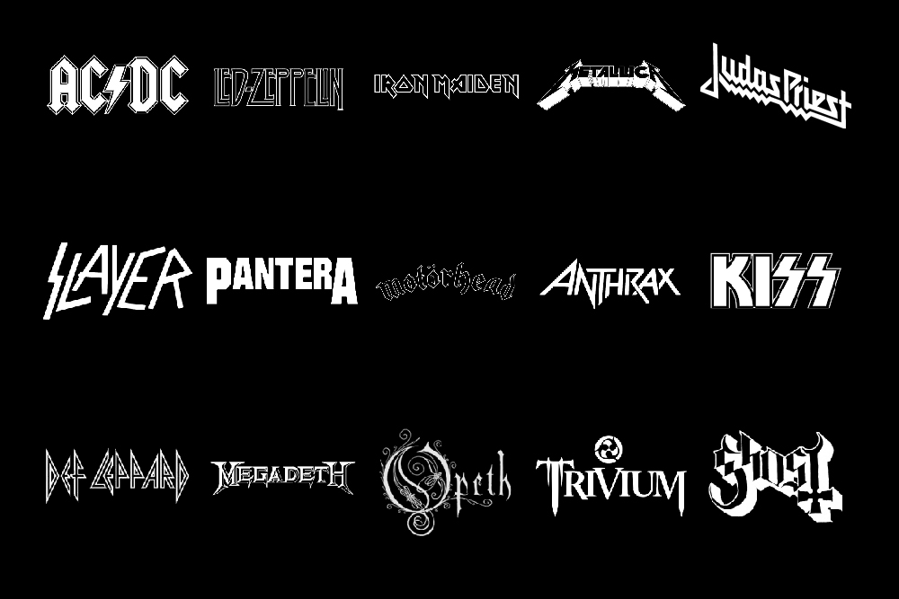

Metal music. We all know it. Some love it. Some hate it. But all can agree that, if nothing else, it is a genre of music that, over the last 60 years, has become globally recognisable both for its iconic sound and for the culture that surrounds and embodies it. 

In this multi-part series, we will look into how design and typefaces are used by different sectors of the musical world; and where better to start than with the often dark and ever intriguing metal scene.

[Rick Poynor](https://designobserver.com/feature/from-the-archive-graphic-metallica/34488) describes the visual style of heavy metal music as being 'aesthetic extremism' with designs often being as over-exaggerated and aggressive looking as possible to match the explosive nature of the music it is presenting. This design culture has given rise to some of the most iconic and memorable iconography in music history.

The traditional metal look comes from a combination of bold aggressiveness, often utilising thick, clear lettering as well as elements of Blackletter to lend a gothic element to the design. This idea is exemplified well in the logo of Swedish metal band *Ghost* (depicted above.)