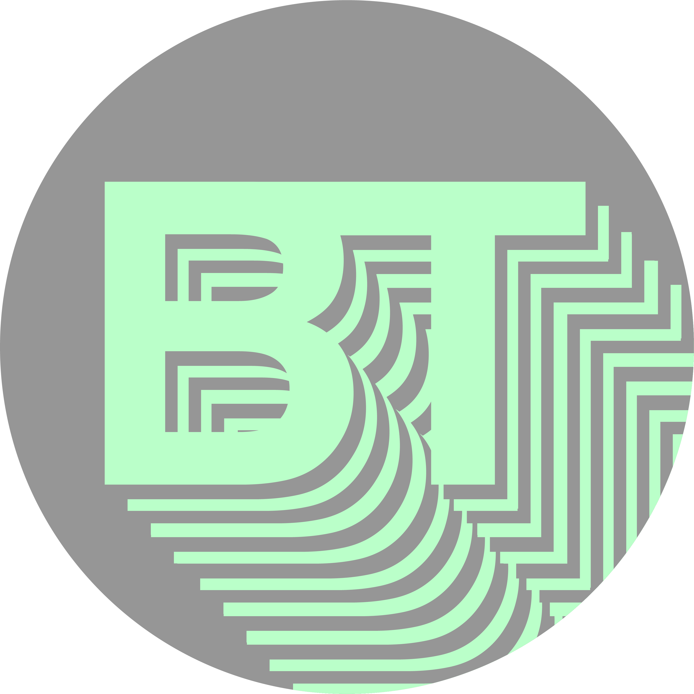

BREAKTEXT aims to create a hub for content on, and examples of, interesting and useful forms of typography and its usage in the modern world. We cover topics from every corner of society to get the broadest, most inclusive view of the modern world of type. 

My name is Seb Ingham, I'm from Oxford and I'm the main contributor to the BREAKTEXT project. I'm a student at Oxford Brookes University currently in my second year of my bachelors degree in Media, Publishing and Journalism. 

If you are interested in making a contribution to the page, please contact me at: 19036711@brookes.ac.uk

**Logo**

My websites logo was created using Adobe Illustrator and incorporates a splitting of the central text, portraying the breaking of complexity in the world of typographic design, hence the mission statement of this blog. 

I wanted to create a modern looking logo without sacrificing the heritage of the topic, hence the choice of Helvetica for the lettering and the modern yet inviting pastel green colouration.