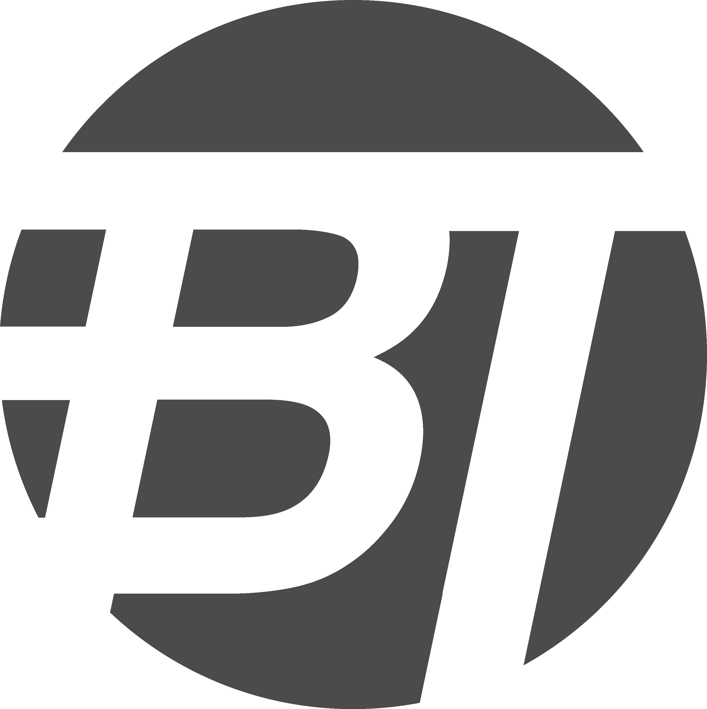

**About the Brand**

BREAKTEXT aims to create a hub for content on, and examples of, interesting and useful forms of typography and its usage in the modern world. 

We cover topics from every corner of society to get the broadest, most inclusive view of the modern world of type. 

**Web Design**

The BREAKTEXT website is characterised by its prominent imagery of New York City's Times Square. This is because I believe it to be one of the most important sites on earth when it comes to typography. Hundreds of ads appear on the big screens every day and are seen by millions globally, making it one of the most intensive physical marketing landscapes anywhere. 

The font used everywhere (excluding the BREAKTEXT logo) is Monserrat. This font was chosed due to it's modern elegance; a strong combination of 

**Logo**

My logo is centred around the idea and usage of negative space to create a smooth yet striking typographical image. Helvetica Bold Oblique was used for the baseline of the design due to its clean, modern aesthetic. 

The extremities of the letters were then stretched outside of the background to create unbroken areas of negative space, representing the text breaking from the traditional mould.

A dark gray background was chosen to prevent the logo from clashing with whatever media it is emblazoned on since the world of typography is often colourful and vibrant. 

If you are interested in making a contribution to the page, please contact me at: 19036711@brookes.ac.uk.